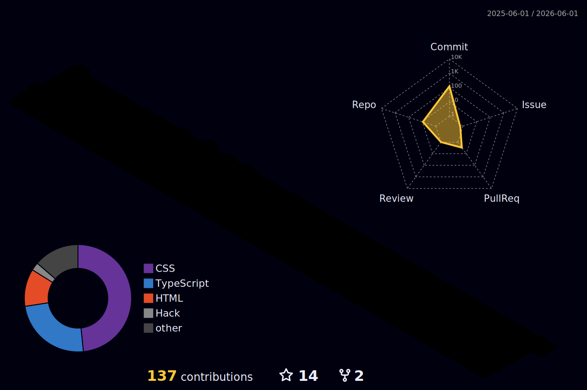

<!-- BANNER -->

<p align="center">
  
</p>

<!-- TYPING -->

<p align="center">
  
</p>

---

## 🚀 Sobre mim

```js
const sal = {
  foco: "Desenvolvimento Web",
  linguagens: ["JavaScript", "TypeScript", "PHP"],
  ferramentas: ["Node.js", "WordPress", "RD Station"],
  especialidade: ["Automação", "Integrações", "UX"],
};
```

---

## 📊 Dashboard

<p align="center">
  
  
</p>

<p align="center">
  
</p>

---

## 🧊 Contribuições 3D

<p align="center">
  
</p>

---

## 🐍 Pac-Man Contributions

<p align="center">
  
</p>

---

## 🛠️ Stack

<p align="center">
  
</p>

---

## 🌐 Contato

<p align="center">
  <a href="https://linkedin.com">
    
  </a>
  <a href="#">
    
  </a>
</p>

---

## ⚡ Filosofia

<p align="center">
  <i>"Código bom resolve problema. Código excelente evita que ele aconteça."</i>
</p>

---

<!-- FOOTER -->

<p align="center">
  
</p>
